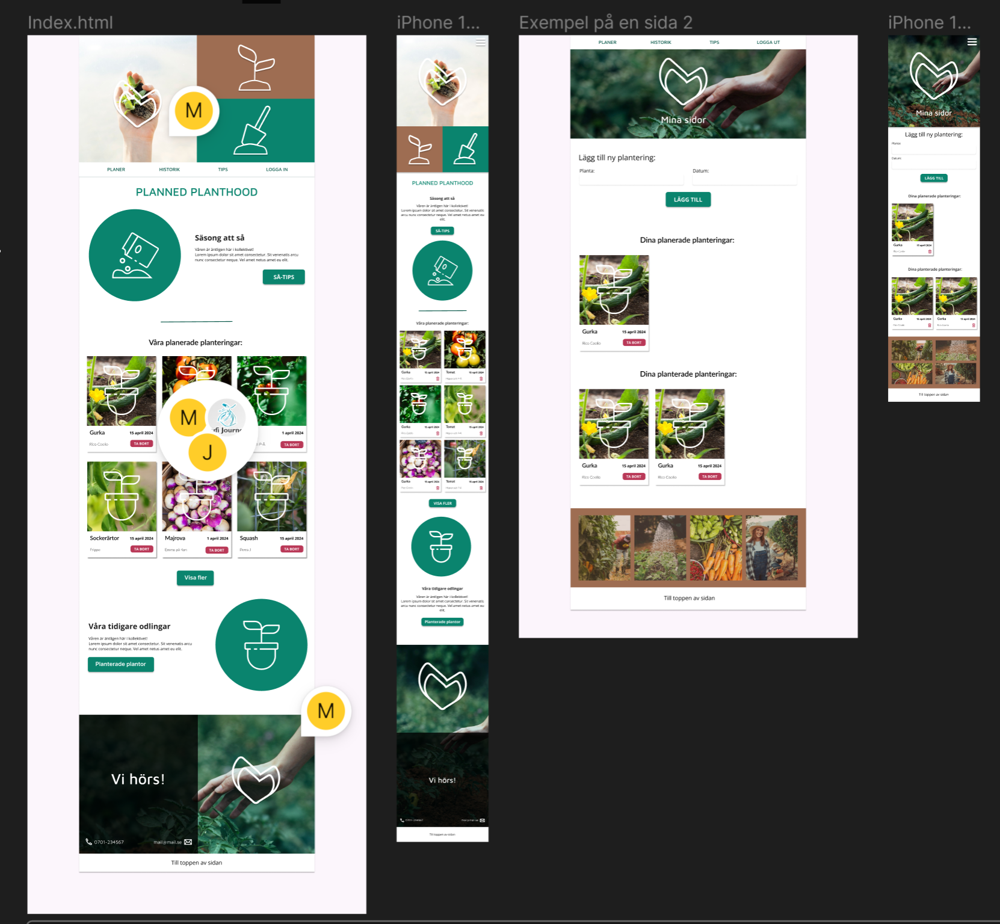

# MU25-Grundlaggande_Frontend_programmering-Vecka4-Examination

# Planned Planthood

## Projektbeskrivning
Detta projekt är en del av kursens gruppuppgift.  
Vi har skapat två statiska webbsidor baserade på en design från Figma.  
Syftet var att öva på HTML-struktur, semantiska element samt grundläggande CSS-layout och responsivitet.  
Observera att länkarna i navigationen inte är aktiva – fokus låg på sidornas utseende enligt designen.

## Skärmbild

## Tekniker som använts

### HTML
- Semantiska element som `<header>`, `<nav>`, `<main>` och `<footer>`.  
- Strukturerad kod med tydlig uppdelning för bättre läsbarhet.  
- Alt-texter för bilder för ökad tillgänglighet.  

### CSS
- Flexbox och grid för att bygga layouten.  
- Media queries för att anpassa designen till mobil och desktop.  
- CSS-variabler för konsekvent färgsättning och typografi.  
- Anpassning efter Figma-designen.  

## Utmaningar & lösningar
- **Att tolka designen från Figma:** Det var ibland svårt att avgöra exakta mått och avstånd.  
  *Lösning:* Vi gjorde gemensamma överenskommelser och följde proportionerna så nära som möjligt.  

- **Responsivitet:** Det var en utmaning att få sidorna att se bra ut på både små och stora skärmar.  
  *Lösning:* Vi använde flexbox och media queries för att justera elementens placering.  

- **Navigationen:** Då projektet endast krävde statiska sidor implementerade vi inte fungerande länkar.  
  *Lösning:* Vi fokuserade på sidornas struktur och design enligt uppgiften.  

## Gruppmedlemmar
Grupp 3  
- Arezoo Shahgaldi  
- Vitaliy Beletskiy  
- Sofia Niyazson  
- Yassin Susaeg Lindblad  
